# A E Q V I P E D I S

`AEQVIPEDIS` turns images into low-resolution triangle-meshes and stores them in an efficiently packed bitstream encoded as `base64`. A complementary JavaScript function dynamically generates SVGs from this binary data. This technique allows to use short chunks of text as a placeholder for high-resolution graphics on the web.

This project was inspired by José M. Pérez's [blog post on SVG placeholders](https://jmperezperez.com/svg-placeholders/).

## How to use

The library generating the triangle representations is written in C++ and has zero dependencies apart from the standard library. This repository includes a standalone demo program which uses the `stb_image` library to load images. `stb_image` will automatically be downloaded by the provided makefile. Compilation was tested with GCC 7.3.1. 

From the command line run
```bash
git clone https://github.com/astoeckel/aequipedis && cd aequipedis && make
```
You can now run the generated `./aequipedis` binary.

### Command line arguments

* **Resolution** `-r`, `--res`. The resolution determines the density of initial feature points that are extracted from the image. Minimum value is `3`, maximum value is `254`. Default value is 16.
* **Maximum feature count** `-m`, `-max_count`. This parameter determines the number of feature points that are actually used, i.e. if `m` is smaller than `r * r` the program removes feature points that are likely to be less relevant for the image. If `-m` is zero, all feature points will be used. Default value is zero.
* **Relative feature threshold** `-t`, `--threshold`. Value between 0.0 and 1.0 that determines which features are discarded. If `0.0` all features are used, independent of the associated edge strength. If `0.5` only features stronger than 50% of the strongest feature are used. If `1.0` only the strongest feature is used. This does not affect border points. Default value is `0.0`.

### Use as a library

To use the code as a library add the provided `aequipedis.cpp` and `aequipedis.hpp` to your C++ project. The `aequipedis.hpp` header contains a fair amount of information on how to use the library.

## Example

Consider the following image


Running
```bash
./aequipedis -r 8 -m 32 image.png
```
produces the following `base64` encoded bitstream
```
IC4IAAAAJABsAJAA2QD/GRIifiKAKM48uEj/bABfJHt9dMhs/5AAgR+TVJtdgYSM5tkAzTnrWsrQ/wD/
SP9s/5D//4UANFsMWpPjAsTX3RvE8+k7ztGxVvr+of6he0NfKa6GSHcbCEcyBwgrCSQEKVZKVn60fbUF
nKOoyaaomnOZgo09AjdQo93H4sfixaBXH11Qtt+26sfp2OTY5Ne1hNN7U4DJeG6jaZBUcw04NH5Qo719
HjcVJRk2M1tk1+vZ3cXUs9m11LPRotKj2rbFUSI1VqXJksNsN2w+f2TXxJHRo4AA
```
Now, in your JavaScript code (requires ES6), you can dynamically generate an SVG from that data
```js
let svg = aequipedis.from_base64('...');
```
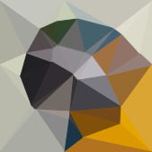

You can also use the `demo.html` included in the `demo` folder to view the images.

## Gallery

The following table shows results produced by running `aequipedis` with varying parameters for `-r` and `-m`. The threshold `-t` was set to `0.05`.

| Original |  *r* = 32 |  *r* = 16 |  *r* = 8 |       |
| :------- |   ---: |   ---: |   ---: |  :--- |
|  | 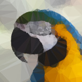 | 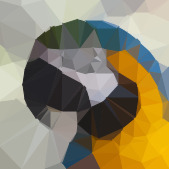 | 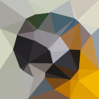 | all points 
|  | 6.5k (4.9k) | 1.9k (1.5k) | 0.5k (0.4k) |
| | 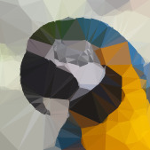 |  | 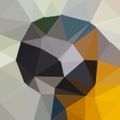 | *n* ≤ 256
| | 3.0k (2.3k) | 1.9k (1.5k) | 0.6k (0.5k) |
| | 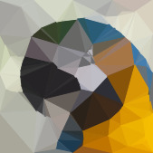 | 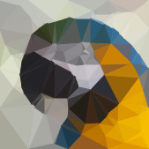 | 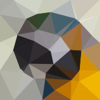 | *n* ≤ 128
| | 1.4k (1.1k) | 1.4k (1.1k) | 0.5k (0.4k) |
| | 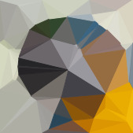 | 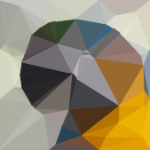 |  | *n* ≤ 64
| | 0.7k (0.5k) | 0.7k (0.6k) | 0.5k (0.4k) |
| | 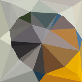 | 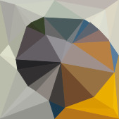 |  | *n* ≤ 32
|  | 0.3k (0.3k) | 0.3k (0.3k) | 0.3k (0.3k) |
|  |  |  | 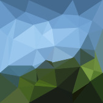 | all points 
|  | 8.5k (6.3k) | 2.2k (1.7k) | 0.5k (0.4k) |
| |  |  |  | *n* ≤ 256
| | 3.0k (2.2k) | 2.2k (1.7k) | 0.6k (0.5k) |
| |  |  |  | *n* ≤ 128
| | 1.4k (1.1k) | 1.4k (1.1k) | 0.5k (0.4k) |
| |  |  |  | *n* ≤ 64
| | 0.7k (0.6k) | 0.7k (0.5k) | 0.5k (0.4k) |
| | 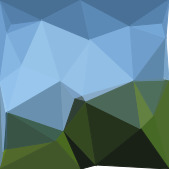 | 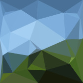 |  | *n* ≤ 32
|  | 0.3k (0.3k) | 0.3k (0.3k) | 0.3k (0.3k) |
|  | 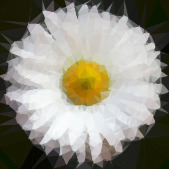 | 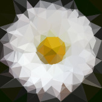 | 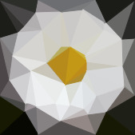 | all points 
|  | 9.8k (7.2k) | 2.3k (1.8k) | 0.5k (0.4k) |
| | 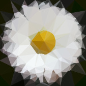 |  | 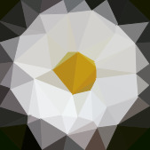 | *n* ≤ 256
| | 3.0k (2.3k) | 2.3k (1.8k) | 0.6k (0.5k) |
| | 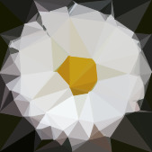 | 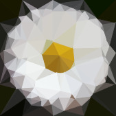 | 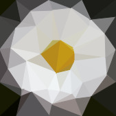 | *n* ≤ 128
| | 1.4k (1.1k) | 1.4k (1.1k) | 0.5k (0.4k) |
| | 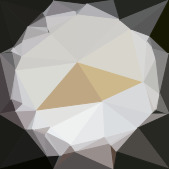 | 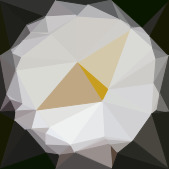 |  | *n* ≤ 64
| | 0.7k (0.5k) | 0.7k (0.6k) | 0.5k (0.4k) |
| | 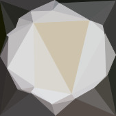 | 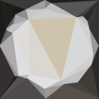 | 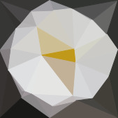 | *n* ≤ 32
|  | 0.3k (0.3k) | 0.3k (0.3k) | 0.3k (0.3k) |
|  | 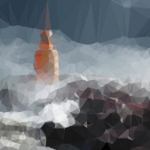 | 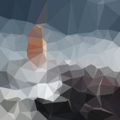 |  | all points 
|  | 8.6k (6.3k) | 2.2k (1.7k) | 0.5k (0.4k) |
| | 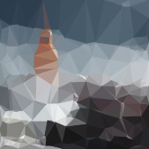 |  |  | *n* ≤ 256
| | 3.0k (2.3k) | 2.2k (1.7k) | 0.6k (0.5k) |
| | 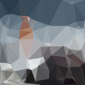 | 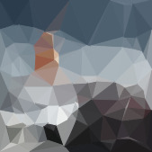 |  | *n* ≤ 128
| | 1.4k (1.1k) | 1.4k (1.1k) | 0.5k (0.4k) |
| | 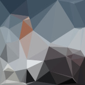 |  |  | *n* ≤ 64
| | 0.7k (0.5k) | 0.7k (0.6k) | 0.5k (0.4k) |
| |  | 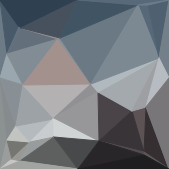 | 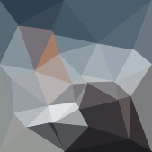 | *n* ≤ 32
|  | 0.3k (0.3k) | 0.3k (0.3k) | 0.3k (0.3k) |

All sizes in `kb` (thousand bytes) of the `base64` encoded output. Size in parentheses are the gzipped size. Images courtesy of [Unsplash](https://unsplash.com/) photographers David Clode, Guy Bowden, Steinar Engeland, and Tina Rolf.

## FAQ

**How does it work?**

The code extracts a set of feature points from the image using a Sobel edge detector. Feature points are filtered according to some spatial constraints as well as edge strength. These points are then converted into a Delaunay triangle mesh following the Bowyer-Watson algorithm. So, nothing fancy, all pretty basic stuff.

**Should I use this code in production?**

Probably not. While this code is extracted from another project of mine that actually has unit tests, I would consider it still quite experimental. There is plenty of pointer magic involved in reading the image data that is only correct if the computational geometry code does not screw up (which it will probably do). Also, this code has been optimised for small images and may be quite inefficient when used with large photos. So be warned.

**What's with the name?**

`AEQVIPEDIS` (or `aequipedis` if you anachronistically allow “u”s in your Latin inscriptions) roughly translates to “of an equal-footed triangle”. Before you ask, no, the triangles generated by this code are not isosceles triangles. But, hey, they *are* triangles after all. So, while the name doesn't make sense, is annoying to type, and hard to pronounce, there was no repository of this name on GitHub; and names with this property are increasingly hard to come by. So here you go!

## Licence

The C++ program and the JavaScript code are made available under two different licences. The C++ code is licensed under the more restrictive [AGPLv3 licence](https://www.gnu.org/licenses/agpl-3.0.en.html), whereas the JavaScript code is licensed under the permissive [MIT licence](https://opensource.org/licenses/MIT).

In a nutshell, this means that you cannot embed the C++ as a library into a server-side program that interfaces with a user without licensing your server program under the AGPLv3 as well. Note that these restrictions do not apply if you just use the output of the provided program as part of a batch process that is not directly involved in user-interaction, e.g. as part of a static site generator that calls the executable.

